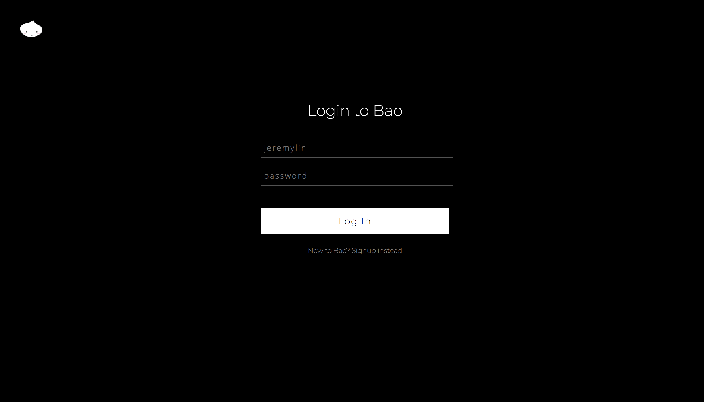
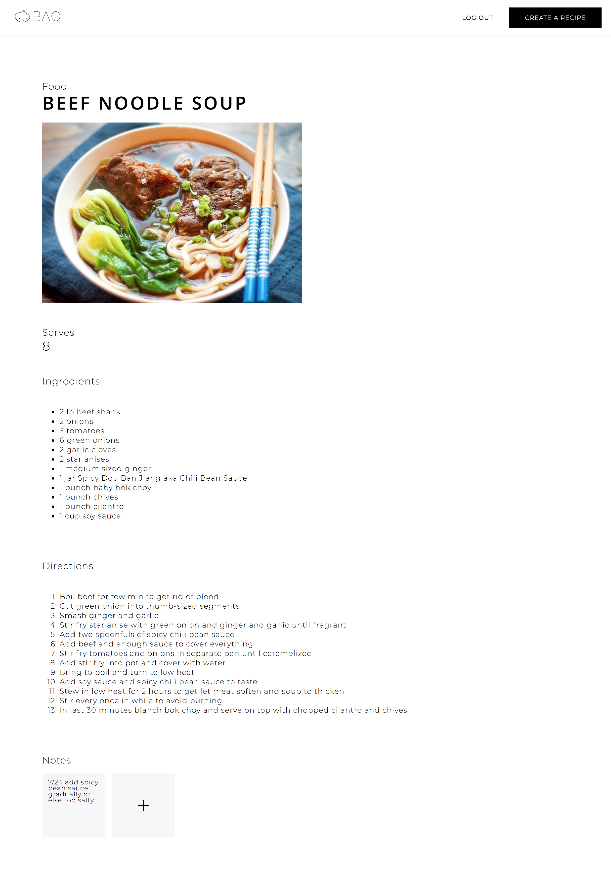
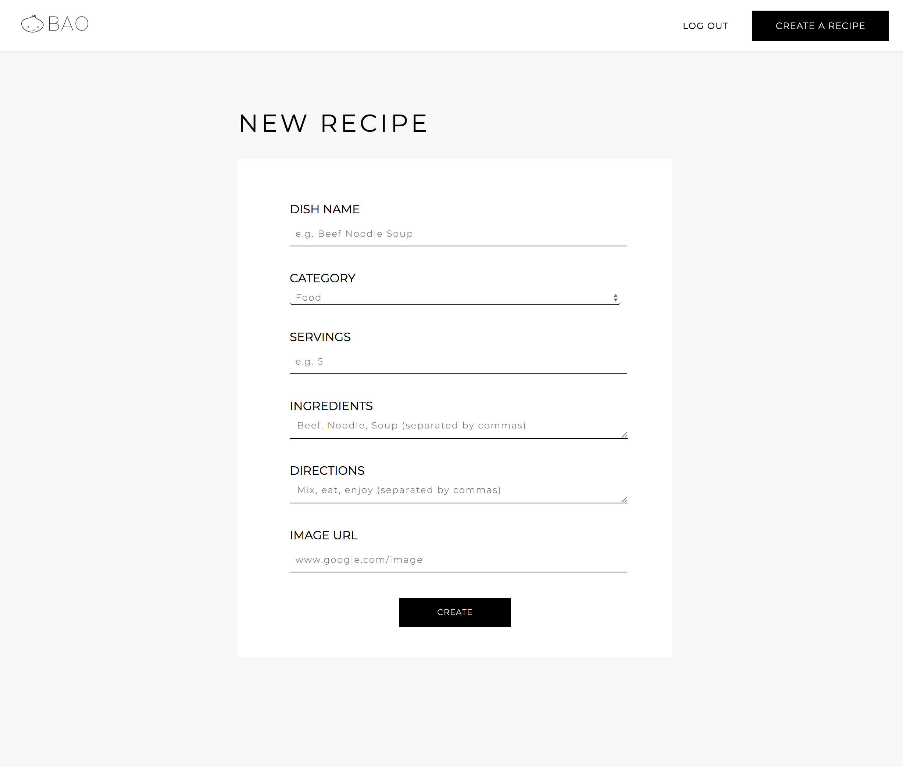
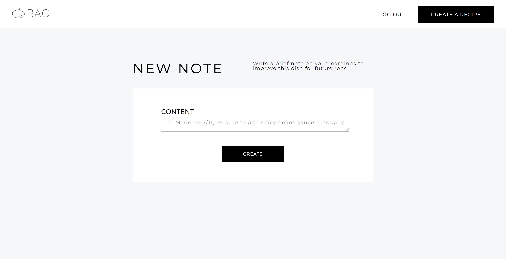

# bao-app
[Demo Bao Here](https://bao-app.herokuapp.com/)

# Summary
Bao is a responsive full-stack application that allows users to view and make personal notes on recipes, specifically in the Taiwanese cuisine. 

View full API documentation [here](https://documenter.getpostman.com/view/4492197/RWMJp66t).

# Screenshots 

# Features

## User Log-In 

Visitors can sign up for an account to create their own recipes or keep track of personal notes on recipes. 

## Recipes

Visitors can view and create recipes. To create recipes, user will first be prompted to log in. 

## Notes

If logged in, visitors can make personal notes on each recipe that are viewable by the user only.

# Wireframes & Graphics

# Technology

* HTML5
* CSS3
* JavaScript
* jQuery
* Node.js
* Express.js
* jsonwebtoken
* bcryptjs
* MongoDB
* Heroku
* Adobe Illustrator

# Coming Soon

- [ ] Build Features. Will allow users to upload their own photos to recipes, buy ingredients directly from website, and add recipes to a to-do list.
- [ ] Increase user interaction with each other. Allow users to rate recipes, add friends, etc.
- [ ] Allow user interaction with data for more customized filtering
- [ ] Creating custom lists of recommended recipes based on user review and note history
